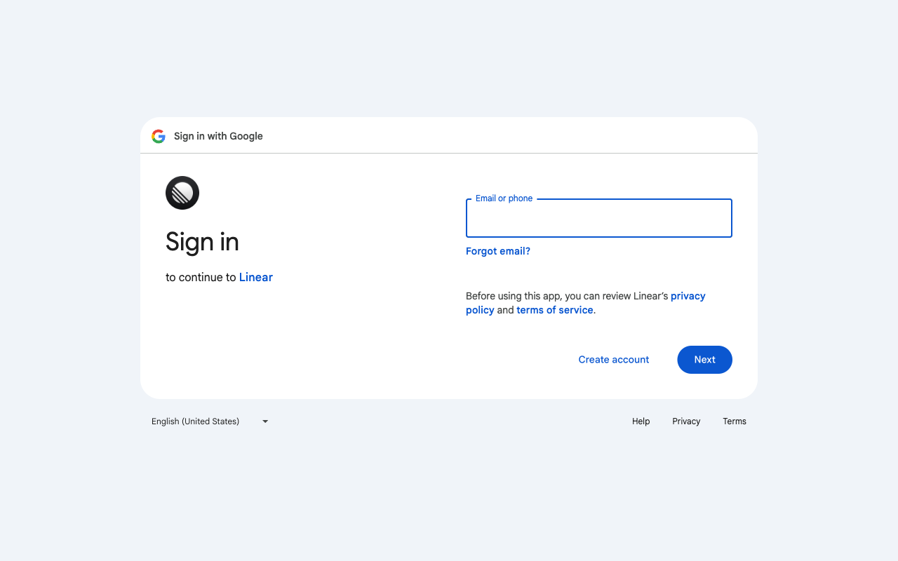
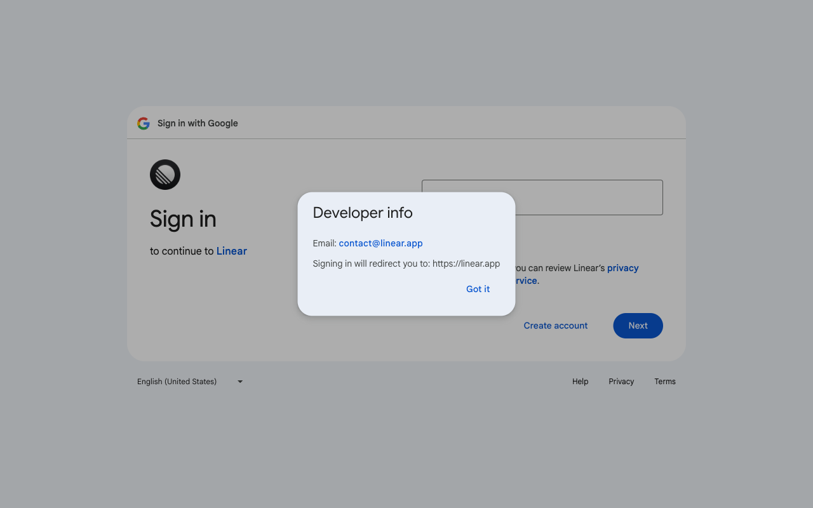

# Execution Report

**Task:** Create a new project in linear

**Total Steps:** 2 unique screenshots (all captured images preserved in run folder)

---

## Step 1

**URL:** `https://accounts.google.com/v3/signin/identifier?opparams=%253F&dsh=S86316689%3A1766425535923407&access_type=offline&client_id=463717515632-5f96ed9uaue5p206umg9toffdbfmsfbm.apps.googleusercontent.com&o2v=2&prompt=consent&redirect_uri=https%3A%2F%2Flinear.app%2Fauth%2Fgoogle%2Fcallback&response_type=code&scope=https%3A%2F%2Fwww.googleapis.com%2Fauth%2Fuserinfo.email+https%3A%2F%2Fwww.googleapis.com%2Fauth%2Fuserinfo.profile&service=lso&state=%7B%22key%22%3A%22R0rlI93qlY78S8hFDZycD0SZcR20I3GZ%22%2C%22isMobileAppLogin%22%3Afalse%7D&flowName=GeneralOAuthFlow&continue=https%3A%2F%2Faccounts.google.com%2Fsignin%2Foauth%2Fconsent%3Fauthuser%3Dunknown%26part%3DAJi8hAOgWkdrbXIHtFx4SsZsu7xcVGHg4ZMNI_x0DgwGev2Kz7RgyJesLaVTcNeBVoMnII86RdsiVknQwEAR8L6cWlzaqgQ2MlsuckHjIChLc_5gGVkUi-MsKiyICCGcuPAa8zpp6tcCpcpSPq7o554LDk0KDM1Z3ZzbEnBNgwvWDUFO6ntToH2OrSmVXZq6RBflGd-p6GYysbjoqBezsW6w043XiITQUDqZgwwrsUbq-tRr6V1lbSvwZgr4kzpQXth-tr3onqswlpXmPRybIrv_UA70DIykt_1Di6U4fl6UtHOQ1ABqtmel4iOYf5-cJm_5NzBL0bT1_tvwBQVihdiZ1_5LOf-_sKZtEGdDcpOMwrmza1efxAjcF94vcInNhfSJvZe6JhMbcDnvHe-BZbGYm17zLw_NnfT8j61Hx96ugcMLp5I9Py0ogHlOXN0Kk77jjL1NgqJouzhywjsZRjeUXZTblBPvLA%26flowName%3DGeneralOAuthFlow%26as%3DS86316689%253A1766425535923407%26client_id%3D463717515632-5f96ed9uaue5p206umg9toffdbfmsfbm.apps.googleusercontent.com%26requestPath%3D%252Fsignin%252Foauth%252Fconsent%23&app_domain=https%3A%2F%2Flinear.app&rart=ANgoxcclrqgIvXWwwCD8KKg_XBOshXtW1JBYWVFzbVMqM2ag7iqXhfTzsU0KqYUzQYyMTsmTX6uIDXIWvv3JuyUa3YGXh2acIsBW-URsJg2IsRp2q1vLAK8`

1. The screen displays a Google sign-in page prompting the user to enter their email or phone number to sign in to continue to Linear. Visible elements include an input field labeled "Email or phone," a "Forgot email?" link, a "Create account" link, and a "Next" button.

2. No action has been taken yet, as the page is awaiting user input to proceed with the login process.

3. Once the user enters their email or phone number and clicks the "Next" button, they will be prompted to enter their password to complete the sign-in process. If successful, they will be redirected to the Linear application.

**➜ Action Taken:**  
_Between Step 1 and Step 2, an interaction was performed, such as entering text or clicking a button, though the exact action is unknown. As a result, there were no visible URL changes, suggesting that any updates occurred within the current page, likely affecting user interface elements or triggering hidden processes._

---

## Step 2

**URL:** `https://accounts.google.com/v3/signin/identifier?opparams=%253F&dsh=S86316689%3A1766425535923407&access_type=offline&client_id=463717515632-5f96ed9uaue5p206umg9toffdbfmsfbm.apps.googleusercontent.com&o2v=2&prompt=consent&redirect_uri=https%3A%2F%2Flinear.app%2Fauth%2Fgoogle%2Fcallback&response_type=code&scope=https%3A%2F%2Fwww.googleapis.com%2Fauth%2Fuserinfo.email+https%3A%2F%2Fwww.googleapis.com%2Fauth%2Fuserinfo.profile&service=lso&state=%7B%22key%22%3A%22R0rlI93qlY78S8hFDZycD0SZcR20I3GZ%22%2C%22isMobileAppLogin%22%3Afalse%7D&flowName=GeneralOAuthFlow&continue=https%3A%2F%2Faccounts.google.com%2Fsignin%2Foauth%2Fconsent%3Fauthuser%3Dunknown%26part%3DAJi8hAOgWkdrbXIHtFx4SsZsu7xcVGHg4ZMNI_x0DgwGev2Kz7RgyJesLaVTcNeBVoMnII86RdsiVknQwEAR8L6cWlzaqgQ2MlsuckHjIChLc_5gGVkUi-MsKiyICCGcuPAa8zpp6tcCpcpSPq7o554LDk0KDM1Z3ZzbEnBNgwvWDUFO6ntToH2OrSmVXZq6RBflGd-p6GYysbjoqBezsW6w043XiITQUDqZgwwrsUbq-tRr6V1lbSvwZgr4kzpQXth-tr3onqswlpXmPRybIrv_UA70DIykt_1Di6U4fl6UtHOQ1ABqtmel4iOYf5-cJm_5NzBL0bT1_tvwBQVihdiZ1_5LOf-_sKZtEGdDcpOMwrmza1efxAjcF94vcInNhfSJvZe6JhMbcDnvHe-BZbGYm17zLw_NnfT8j61Hx96ugcMLp5I9Py0ogHlOXN0Kk77jjL1NgqJouzhywjsZRjeUXZTblBPvLA%26flowName%3DGeneralOAuthFlow%26as%3DS86316689%253A1766425535923407%26client_id%3D463717515632-5f96ed9uaue5p206umg9toffdbfmsfbm.apps.googleusercontent.com%26requestPath%3D%252Fsignin%252Foauth%252Fconsent%23&app_domain=https%3A%2F%2Flinear.app&rart=ANgoxcclrqgIvXWwwCD8KKg_XBOshXtW1JBYWVFzbVMqM2ag7iqXhfTzsU0KqYUzQYyMTsmTX6uIDXIWvv3JuyUa3YGXh2acIsBW-URsJg2IsRp2q1vLAK8`

1. The screen displays a Google Sign-In page for Linear with a pop-up titled "Developer info." It includes the email contact@linear.app and indicates that signing in will redirect to https://linear.app.

2. The "Got it" button within the pop-up has been clicked, acknowledging the developer information provided.

3. After closing the pop-up, the user will continue with the sign-in process by either entering an email address and clicking "Next" or exploring other options like creating an account or viewing terms and privacy information.

---

