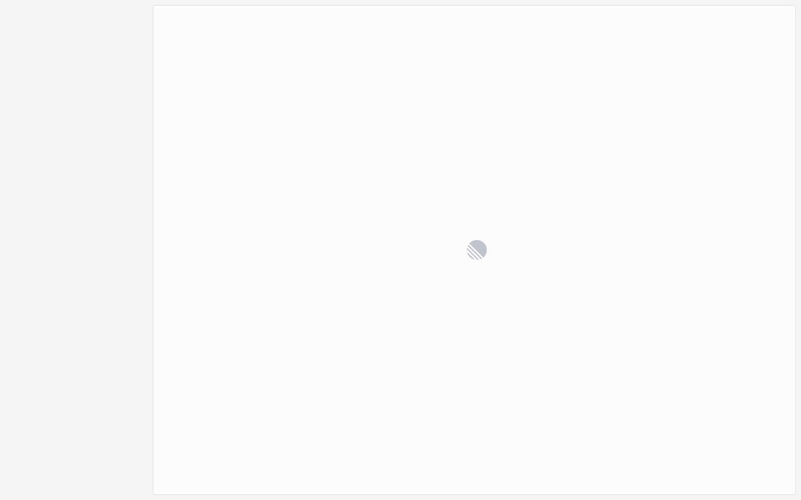
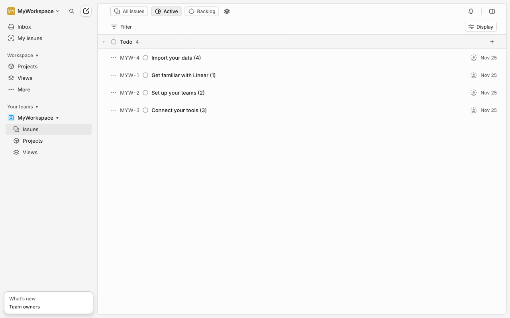

# Execution Report

**Task:** Create a new project in linear

**Total Steps:** 4 unique screenshots (all captured images preserved in run folder)

---

## Step 1

**URL:** `https://linear.app/auth/google/callback?state=%7B%22key%22%3A%22ZtXaG0ZY4peI3RNgqvGLZ8SN4VNOFwPp%22%2C%22isMobileAppLogin%22%3Afalse%7D&code=4%2F0ATX87lN06AVmIuMleniHoG9D0UCDqQDaNGT85nL6UYYKIlbWRFIQ8iFXT45VKZqPqS3FvA&scope=email+profile+https%3A%2F%2Fwww.googleapis.com%2Fauth%2Fuserinfo.profile+https%3A%2F%2Fwww.googleapis.com%2Fauth%2Fuserinfo.email+openid&authuser=0&prompt=consent`

1. The screenshot shows a white screen with a loading spinner in the center, indicating that content is currently being processed or loaded.
2. The action taken matches a post-login state, where the application is handling the authentication response and is likely setting up the user session.
3. Once the loading is complete, the user should expect to be redirected to the main dashboard or home page of the application, where further interaction with the app can take place.

**➜ Action Taken:**  
_In Step 1, an authentication action was completed, redirecting the user from the Google authentication callback URL to their Linear workspace URL, where they now have access to view all projects within "myuniqueworkspace456"._

---

## Step 2

**URL:** `https://linear.app/myuniqueworkspace456/projects/all`

1. The screen shows a web application with a sidebar on the left featuring sections like "Inbox," "My issues," "Projects," and "Views" under the "Workspace" category. The "Projects" section is highlighted, indicating it was clicked.

2. The page is currently in the "Projects" view, displaying a list of tasks under the "Todo" category, such as “Import your data” and “Set up your teams,” each with identifiers and due dates.

3. Next, the user can expect to manage or interact with the listed projects, such as updating tasks, adding new items, or navigating further into specific project details, depending on available actions on the page.

**➜ Action Taken:**  
_After clicking on the 'Projects' section in the sidebar, the page content updated to display the 'Projects' section, while the URL remained unchanged._

---

## Step 3

**URL:** `https://linear.app/myuniqueworkspace456/projects/all`

1. The screen shows the "Projects" section of the Linear app UI, with options like "Inbox," "My issues," and "Projects" in the sidebar. The central area displays information about projects and includes a "Create new project" button alongside a brief description of what projects entail.

2. The action taken was clicking the "Create new project" button, indicated by its visual emphasis in the description. This state suggests the user intends to start creating a new project.

3. Next, the user can expect a new project creation form or interface to appear, allowing them to input details and settings for their new project.

**➜ Action Taken:**  
_Upon clicking the 'Create new project' button, a modal or form likely appeared on the same page, prompting the user to enter details for the new project, while the URL remained unchanged._

---

## Step 4

**URL:** `https://linear.app/myuniqueworkspace456/projects/all`

1. The screen displays a project creation form within the Linear app. Visible UI elements include fields for "Project name," a summary input, a larger text area for project description or ideas, and several buttons such as "Backlog," "No priority," "Lead," "Members," "Start," "Target," "Labels," and the "Create project" button at the bottom.

2. The action taken involved entering text into the "Project name" field, indicating the start of the project creation process. The form is ready for further input or adjustments to project details.

3. Next, the user is expected to fill in additional project details, such as a summary, description, and any relevant tags or priority settings. After completing these fields, clicking the "Create project" button will finalize the project setup.

---

