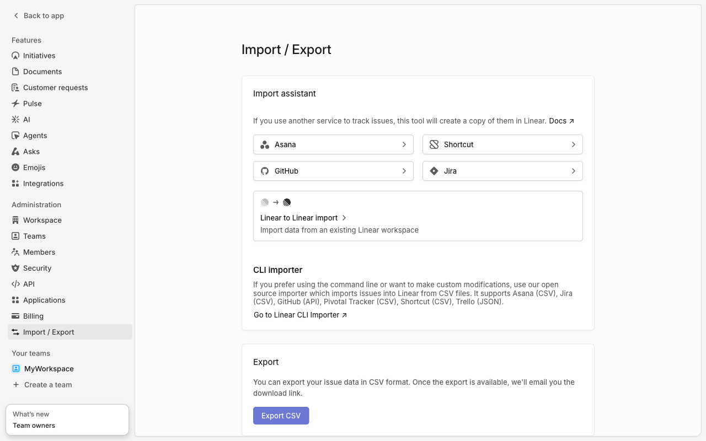
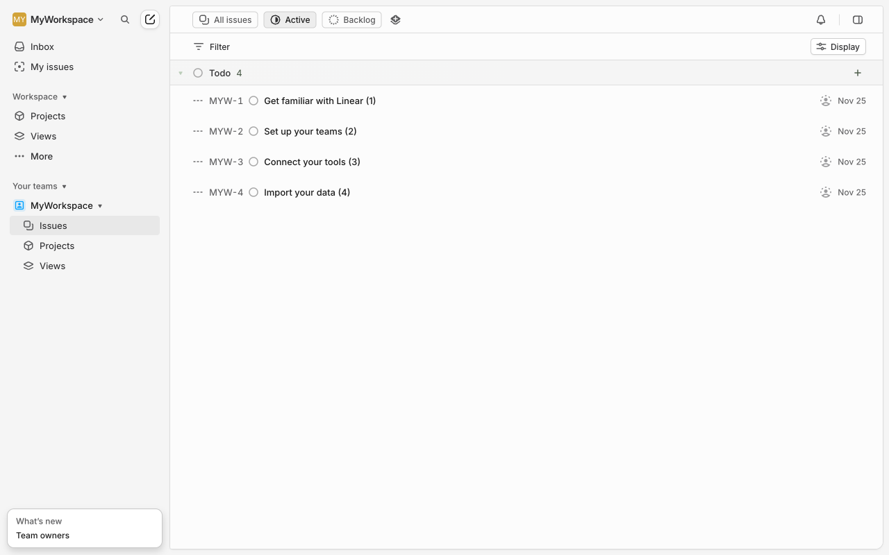
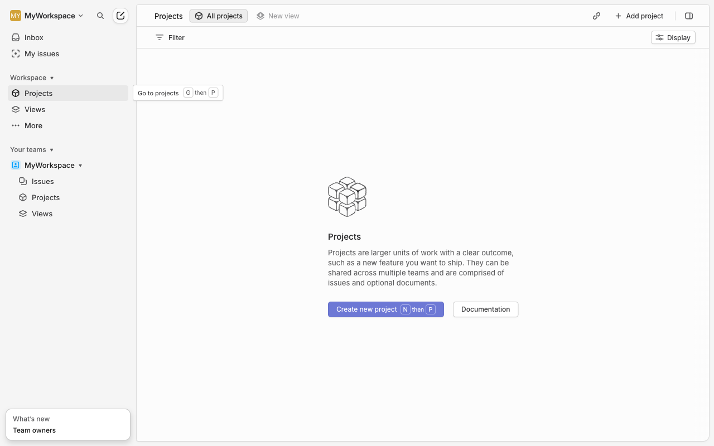

# Execution Report

**Task:** Create a project in linear with project name "My first project" & Add description as this is our first project.

**Total Steps:** 4 unique screenshots (all captured images preserved in run folder)

---

## Step 1

**URL:** `https://linear.app/myuniqueworkspace456/settings/import-export`

1. The screenshot shows the "Import / Export" section of a workspace settings page in Linear. It includes options for importing data from various services like Asana, GitHub, Shortcut, and Jira, as well as a button for exporting issue data in CSV format.

2. The page is in a state where it displays import options and information, but no action has been taken yet, as indicated by "Action taken: N/A."

3. Next, a user might select one of the import options to start transferring data into Linear, or initiate a CSV export by clicking the “Export CSV” button, leading to an email with the download link when the export is ready.

**➜ Action Taken:**  
_After the user initiated an action, the system redirected from the "Import/Export" settings page to the "All Projects" overview, indicating a navigation to view or manage the list of current projects within the workspace._

---

## Step 2

**URL:** `https://linear.app/myuniqueworkspace456/projects/all`

1. **Visible on the Screen**: The UI displays a project management dashboard with a left sidebar containing navigation options such as "Inbox," "My Issues," "Projects," and "Views." The main area shows a list of to-dos with associated tasks, each marked with a unique identifier and task name.

2. **Action Taken or Page State**: The "Projects" option in the sidebar has been clicked, leading to the current view which is focused on project tasks. The page appears to be in a state ready for project management activities but without opening a new project yet.

3. **Next Steps or Expectations**: To proceed with creating a new project, look for and click the 'New Project' button, typically found in a toolbar or as a prominent button, to begin the project creation process.

**➜ Action Taken:**  
_After clicking on 'Projects', the user interface displayed the 'New Project' button, allowing the user to initiate the creation of a new project, without any change to the current URL._

---

## Step 3

**URL:** `https://linear.app/myuniqueworkspace456/projects/all`

1. The screen shows a UI for managing projects in a workspace called "MyWorkspace." The main area displays a description of what projects are, and at the bottom, there's a purple button labeled "Create new project" and a secondary button for "Documentation." The left sidebar contains navigation options for Inbox, Issues, Projects, and Views.

2. The page is in a state where a user is about to create a new project, indicated by the action to click on the "Create new project" button.

3. After clicking the "Create new project" button, a form is likely to appear where the user will be prompted to enter the project name and description, as per the task's step description.

**➜ Action Taken:**  
_Upon clicking 'Create new project,' a modal or form likely appeared within the same page, prompting the user to enter the project name and description while the URL remained unchanged._

---

## Step 4

**URL:** `https://linear.app/myuniqueworkspace456/projects/all`

1. The screen shows a project creation interface within the Linear app. Visible elements include a 'Project name' field, project status buttons (e.g., Backlog, No priority), and a text area for a project description.

2. The action taken was clicking the "Create project" button, indicating that the user has filled in the necessary information to create a new project.

3. Next, the project will be added to the list of projects in the user's workspace. The user might expect to be redirected to the project's main page or get a confirmation message.

---

