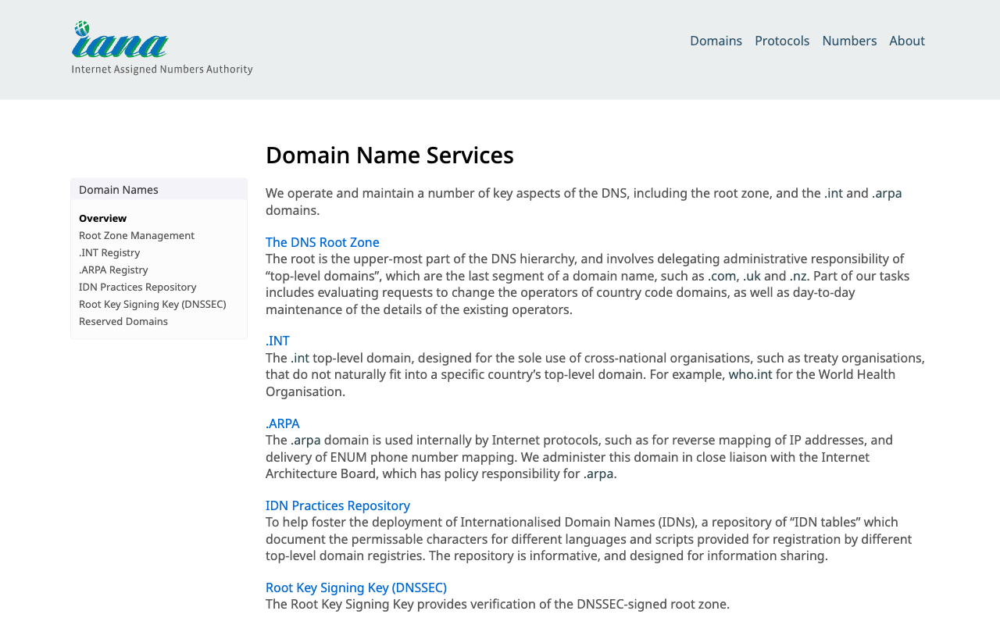

# Execution Report

**Task:** How do I create a project in Linear?

**Total Steps:** 2 unique screenshots (all captured images preserved in run folder)

---

## Step 1

**URL:** `https://example.com/`

1. The screenshot displays the "Example Domain" webpage, which includes a title, a brief description about its purpose for documentation, and a hyperlink labeled "Learn more."

2. The page appears to be in its default state, likely accessed after the login attempt. No specific actions related to the dashboard have been performed as the URL corresponds to a placeholder page.

3. Next, the user might attempt to navigate to the correct dashboard URL or ensure that the login step directed properly to the intended dashboard, given that this page does not display the expected content.

**➜ Action Taken:**  
_The automation navigated away from the current page at "https://example.com/..." and redirected the browser to a new page at "https://www.iana.org/domains," indicating a URL change and a shift in the content displayed to the user._

---

## Step 2

**URL:** `https://www.iana.org/domains`

1. The screen displays the "Domain Name Services" section of the IANA website, with a sidebar menu on the left listing options like Overview, Root Zone Management, and .INT Registry. The main content explains various aspects of DNS management, such as "The DNS Root Zone" and ".INT" domains.

2. No specific action has been taken as indicated by "N/A on 'N/A'." The page is in a static state, displaying information about domain name services without any interaction.

3. Next steps may involve navigating through the sidebar menu to explore other sections like Root Zone Management or .INT Registry for more detailed information on those topics.

---

