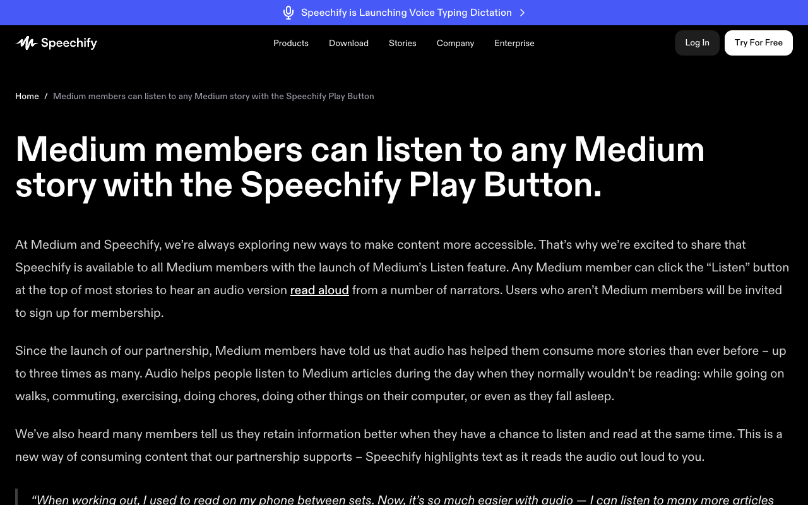

# Execution Report

**Task:** Summarize The Articles On Rag In Medium App

**Total Steps:** 2 unique screenshots (all captured images preserved in run folder)

---

## Step 1

**URL:** `https://speechify.com/medium/`

1. The screen shows the Speechify homepage after logging in, featuring a header with navigation links (Products, Download, Stories, Company, Enterprise), and buttons labeled "Log In" and "Try For Free." The main content highlights a partnership with Medium, promoting the Speechify Play Button, which allows Medium members to listen to stories.

2. No specific action is indicated as taken; the page displays information about the service and its features.

3. The next step might involve engaging with the page further, such as navigating through the site or utilizing the Speechify Play Button feature. Users may also click "Try For Free" to explore the service.

**➜ Action Taken:**  
_The automation transitioned to a new page by navigating from the medium content section to the voice typing and dictation feature page, indicating a change in the main content focus._

---

## Step 2

**URL:** `https://speechify.com/voice-typing-dictation/`

1. The screen displays the Speechify homepage highlighting "Voice Typing Dictation. Just Talk." It features two buttons: "Download for macOS" and "Add to Chrome," along with information about typing speed benefits using Speechify.

2. The page is currently in a promotional state, showcasing Speechify's voice typing capabilities with no specific action taken. Information about its download options and user statistics are visible.

3. The next step likely involves selecting one of the download options, either for macOS or Chrome, to initiate the installation or extension process.

---

