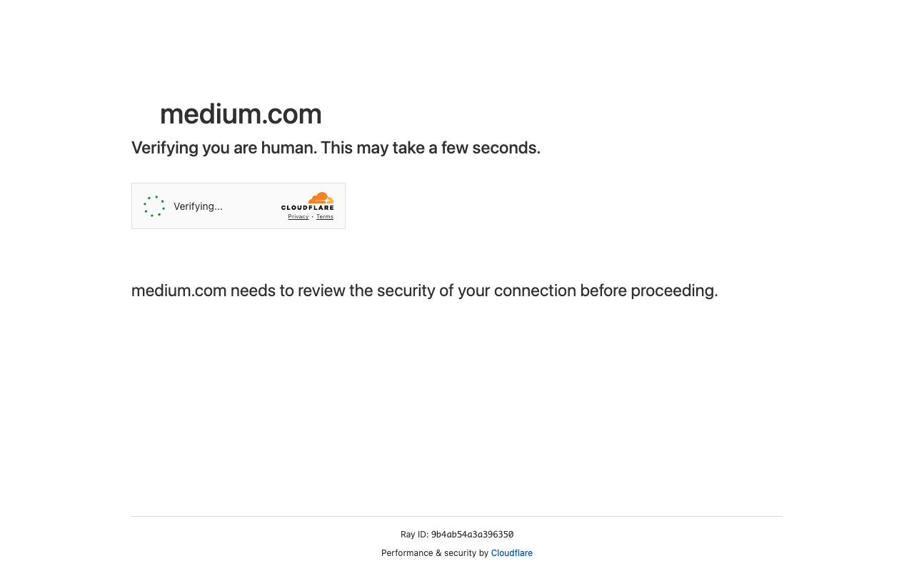

# Execution Report

**Task:** Summarize The Articles On Rag In Medium App

**Total Steps:** 1 unique screenshots (all captured images preserved in run folder)

---

## Step 1

**URL:** `https://medium.com/`

1. The screen displays a verification page from medium.com, indicating that the system is checking if the user is human. A progress indicator shows "Verifying..." with the Cloudflare logo and links to privacy and terms.
   
2. The page is in a security check state, where it is waiting to verify the user's connection before allowing access, as indicated by the message on the screen.

3. Once the verification is complete, the user will be redirected to the main page of the website, where they can proceed with the login process by clicking the 'Sign in' button, if not already logged in.

---

