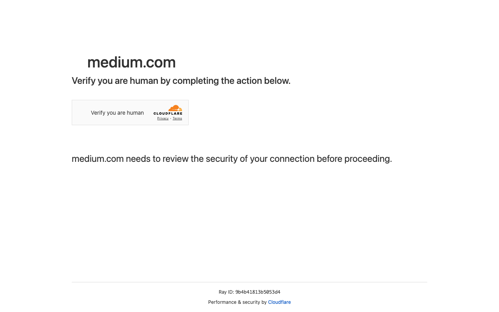

# Execution Report

**Task:** Summarize The Articles On Rag In Medium App

**Total Steps:** 1 unique screenshots (all captured images preserved in run folder)

---

## Step 1

**URL:** `https://medium.com/`

1. The screen displays a security check page from Cloudflare on medium.com, where a prompt asks the user to "Verify you are human" to ensure a secure connection. Below the prompt, there is a message noting that the site's security needs assessment before proceeding.

2. No action has been taken yet, as this is the verification step requiring user interaction with a checkbox or similar mechanism to continue.

3. Upon verification completion, the user should expect to proceed to Medium's homepage, assuming the security check passes.

---

