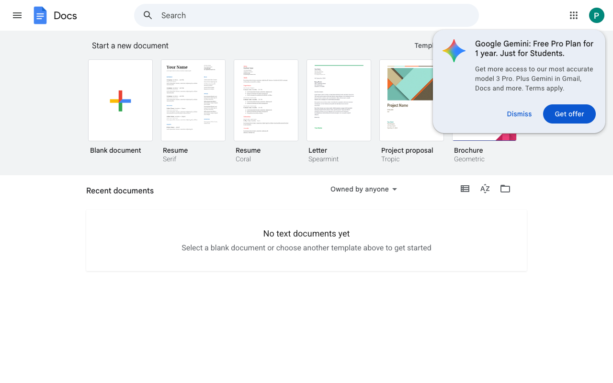

# Execution Report

**Task:** Create a Google doc with name RAG. Inside the document add the details about the RAG in detail.

**Total Steps:** 2 unique screenshots (all captured images preserved in run folder)

---

## Step 1

**URL:** `https://docs.google.com/document/u/0/`

1. The screen displays the Google Docs dashboard with options to start a new document using various templates including "Blank document," "Resume," and "Project proposal." A notification about a "Google Gemini: Free Pro Plan for 1 year" offer appears at the top right.

2. The page is in a state where the user has logged in but has not yet created or opened any documents, as indicated by the "No text documents yet" message.

3. The next steps could involve dismissing the notification or choosing to "Get offer." The user may start a new document by selecting a template, or manage existing documents once they have been created or uploaded.

**➜ Action Taken:**  
_Between Step 1 and Step 2, an unidentified action was performed within the Google Document interface that did not alter the URL. No visible changes to the page, like a modal or new section opening, are indicated in the transition details._

---

## Step 2

**URL:** `https://docs.google.com/document/u/0/`

1. The screenshot shows the Google Docs homepage interface, displaying options to start a new document with various templates such as "Blank document," "Resume," "Letter," and more. A banner titled “Recent documents” indicates that no text documents have been created yet.

2. No specific action has been taken as the screen is in a default state, showing available templates. The user has not yet opened or created any documents.

3. The next expected action is for the user to select a template or start a new document. This will transition the user into the document editor to begin creating or editing content.

---

