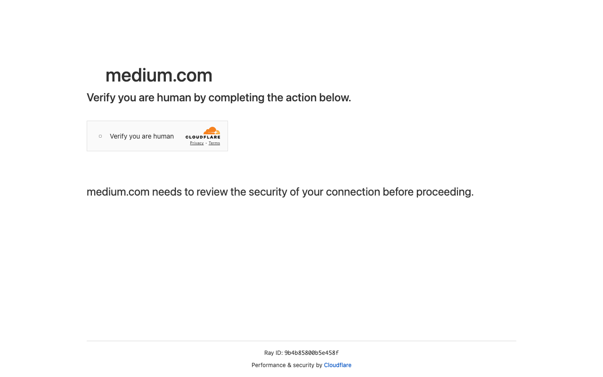

# Execution Report

**Task:** Summarize The Articles On Rag In Medium App

**Total Steps:** 1 unique screenshots (all captured images preserved in run folder)

---

## Step 1

**URL:** `https://medium.com/`

1. The screen displays a verification page from Cloudflare on medium.com, requesting the user to complete a CAPTCHA to verify they are human. A checkbox labeled "Verify you are human" is visible.

2. The current state indicates a security step where the CAPTCHA has yet to be completed, as the checkbox remains unchecked.

3. Once the user completes the CAPTCHA by checking the box, medium.com will review the connection and, if verified, proceed to grant access to the requested page.

---

