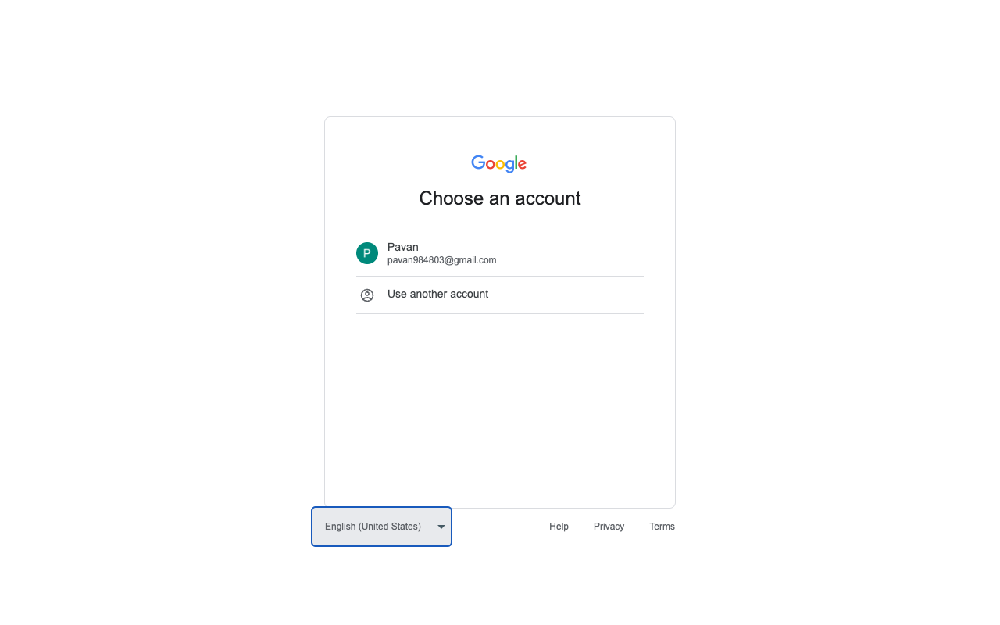
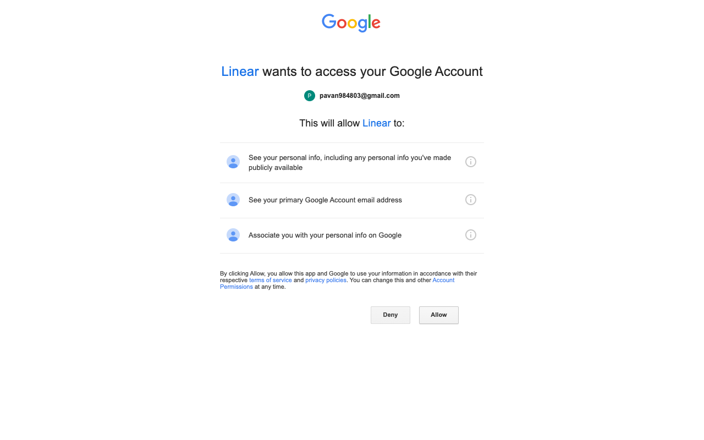
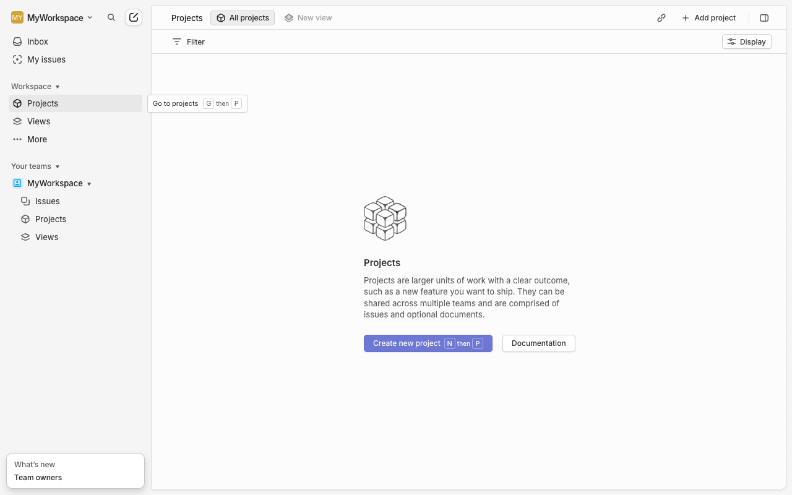

# Execution Report

**Task:** Create a project in linear with project name "My first project" & Add description as this is our first project.

**Total Steps:** 4 unique screenshots (all captured images preserved in run folder)

---

## Step 1

**URL:** `https://accounts.google.com/v3/signin/accountchooser?continue=https%3A%2F%2Faccounts.google.com%2Fsignin%2Foauth%2Flegacy%2Fconsent%3Fauthuser%3Dunknown%26part%3DAJi8hAOnQhkdf84iKUb3orJhv_Bqp7Nlma1aRbOzUkCiICNXCW62GnED6Qp9XVqnn1P282PRRgKEmVjVE-AttGAFyWH56IoiZarTtvqfd7vCdwEKS2ClmMzaY5yQ_vzuNiysc7O6iEOkB-jqaY_HPhxwPJAK-VryVreyASugFftFYj2WE5ossb-XjJpVoQAu6P6taIZqEWEskSOnPT7w25SHmc1bWVh3wWDMKlSUwCU2XVTY1NoEwLP09u0oovQYU0oaCsEMSMmukw82k2EYHPN0cFxK2KQpgEv4M0-xxleoSYVIzq_qmEoo6AWu6R83JjfkebVXNqUVAscmJn3aXrqYOQedtI3Gt9Z_HldUfAZuBfUEYCNzQ6fT3hPD93mYOm1MNAq6eeijox7Yap2OrKvyOiZnWOXVomhGvA7z7M2Hf9J-VKWjEJlSCl8IHGZZbipXEP6EBvfUkVn_mK3URMiGF7Od8__M2g%26flowName%3DGeneralOAuthFlow%26as%3DS-349122420%253A1766867107601097%26client_id%3D463717515632-5f96ed9uaue5p206umg9toffdbfmsfbm.apps.googleusercontent.com%23&oauth=1&flowName=WebLiteSignIn&flowEntry=AccountChooser&dsh=S-483598084%3A1766867107753098`

1. The screen displays the "Choose an account" page from Google, showing one available email address and an option to "Use another account." A language selection dropdown, currently set to "English (United States)," is also visible at the bottom.

2. No specific action has been taken yet, and the page is in the account selection state, ready for the user to select an account to log in or add a new account.

3. The next expected action is for the user to either select an existing account to proceed with the login process or choose to use another account for logging in.

**➜ Action Taken:**  
_The user navigated from the account chooser screen to the OAuth consent page in the Google Sign-In process, indicating progression towards granting permissions for an application to access their account. This transition involves a change in the URL, reflecting the movement to a different stage in the authorization process._

---

## Step 2

**URL:** `https://accounts.google.com/signin/oauth/legacy/consent?authuser=0&part=AJi8hANXzb1IWfVwggrCu6L-K55ANzMyRWtd1j3BV-FIiZ8fRdWcepKZ5eUXX1vqWyzrgRU0aGkWG1AGC5zBv-b6YrMOR4Ko0HvZMw-AX9K6UNf9wzwIXVRKyV7-7HjAztPqfZAcryEztUL_WJR5SQnrmNith3NllxMwjvHfZTvu6Y6jue_w_y3wEZ-UnyQaTlY8Nwr8czCpUuwqUYuMJUNn5W_1KHPmgdNUTtSRKmQ5fHOhHa5_4M1bzi--LpTlYn3bOTW2xrzixwO6d6DWkWrnR1kotHXp3Lwx1VHkeCZkxmodRZB0aQSXxcJw92Dfkv1sqGqzsp6s23xTxfyDcZsecUwSnaxnxV53b5eUrz2d7ViaFqTTGqLhfg3VU-J9EP4M7jmagquPZfkSd-gER0pH11rzmqzaVs_PvK_inhgcIyTD9KnWhJiKS3w66F27T0zzplIR95ja9SiBx3jVqi3tE7AcIt4pbw&flowName=GeneralOAuthFlow&as=S-147612734%3A1766867122015763&client_id=463717515632-5f96ed9uaue5p206umg9toffdbfmsfbm.apps.googleusercontent.com&pli=1&rapt=AEjHL4PAxZfnMnx0r5pYgK6EuYrwwWx8mmuLYk4Dy4cVF2k6oaU1FGgEoxnHH_XrI9eWCIEP_a8J-4vbOpn7oDTYls6YICBR67GDcP-XdZv0kxBxHvWdeYg`

1. The screen displays a Google authorization request page where the app "Linear" seeks permission to access a user's Google account. It lists the permissions requested, such as viewing personal info, accessing the primary email address, and associating with personal info on Google.

2. The "Allow" button has been clicked, indicating consent to grant the requested permissions to the app.

3. Next, the user will likely be redirected back to the "Linear" app or its associated platform where the Google account access will be utilized to perform specific functions or link accounts.

**➜ Action Taken:**  
_After clicking 'Allow' to grant necessary permissions, the application redirected from the Google consent page to the workspace's project management page, indicated by the change in URL. This transition enabled the user to access and input descriptions for a new project within their Linear workspace._

---

## Step 3

**URL:** `https://linear.app/myuniqueworkspace456/projects/all`

1. The screen displays a project management interface, focusing on the "Projects" section within the "MyWorkspace" environment. The UI features options on the left sidebar for navigation, and in the main area, buttons for "Create new project" and "Documentation" are visible.

2. The page is in a neutral state, waiting for user interaction, specifically on the "Projects" section without any active projects displayed. No specific action has been taken according to the screenshot context.

3. The next step likely involves the user creating a new project by clicking the "Create new project" button, which will initiate the process to add and configure a new project within the workspace.

**➜ Action Taken:**  
_Between Step 3 and Step 4, an unknown action was executed as part of the adaptive verification cycle 3. Although the URL remained the same, indicating no navigation occurred, it's likely that an internal or background process related to verification was updated or completed, reflecting in the UI without any visible changes to the content or layout of the page._

---

## Step 4

**URL:** `https://linear.app/myuniqueworkspace456/projects/all`

1. The screen displays a "New project" creation form within the MyWorkspace section of a project management tool. Visible elements include fields for entering the project name, summary, description, and options to assign backlog, priority, and other project parameters.

2. The state of the page is a project setup phase where no specific action has been taken yet. The form fields are ready for user input, and no data is entered.

3. The next expected action is to fill in the project details and utilize buttons like "Create project" to save the new project or "Cancel" to exit without saving.

---

