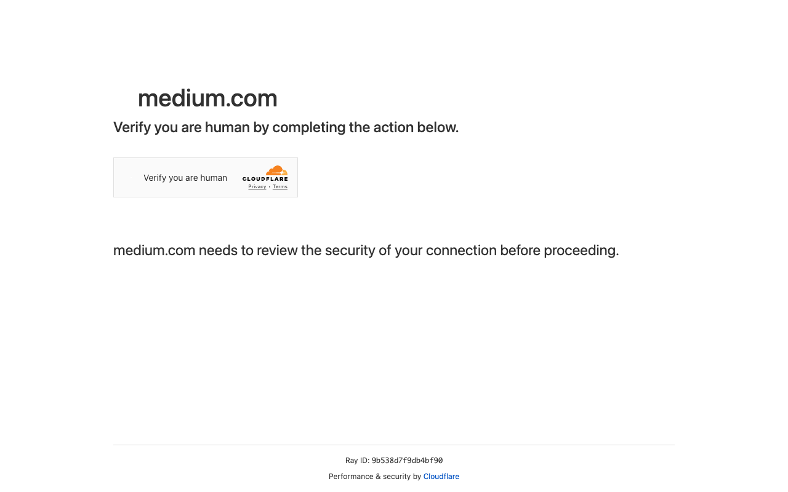

# Execution Report

**Task:** Summarize The Articles On Rag In Medium App

**Total Steps:** 1 unique screenshots (all captured images preserved in run folder)

---

## Step 1

**URL:** `https://medium.com/`

1. The screen displays a security check requiring the user to verify they are human, with a "Verify you are human" button alongside Cloudflare branding. Below, there is a message indicating the need to review the connection's security.

2. No action has been taken yet; the page is in a pre-authentication state where the user must complete the security verification.

3. Next, the user will need to complete the CAPTCHA verification. Once successful, they can expect to proceed to Medium's main website after the security check is verified.

---

