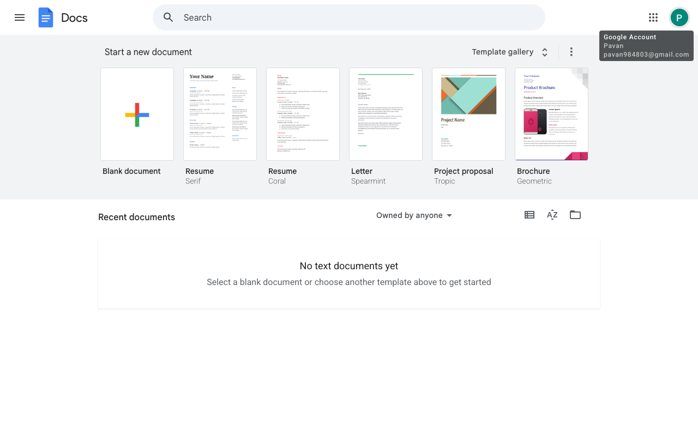

# Execution Report

**Task:** Create a Google doc with name RAG. Inside the document add the details about the RAG in detail.

**Total Steps:** 1 unique screenshots (all captured images preserved in run folder)

---

## Step 1

**URL:** `https://docs.google.com/document/u/0/`

1. The screen displays the Google Docs homepage with options to start a new document, including templates such as "Blank document" and "Resume." The user profile icon and account information are visible in the top-right corner.

2. The page is in a post-login state, confirming access to Google Docs with no recent documents listed, as indicated by the "No text documents yet" message.

3. Next, the user can either start a new document using one of the templates provided or upload an existing document.

---

