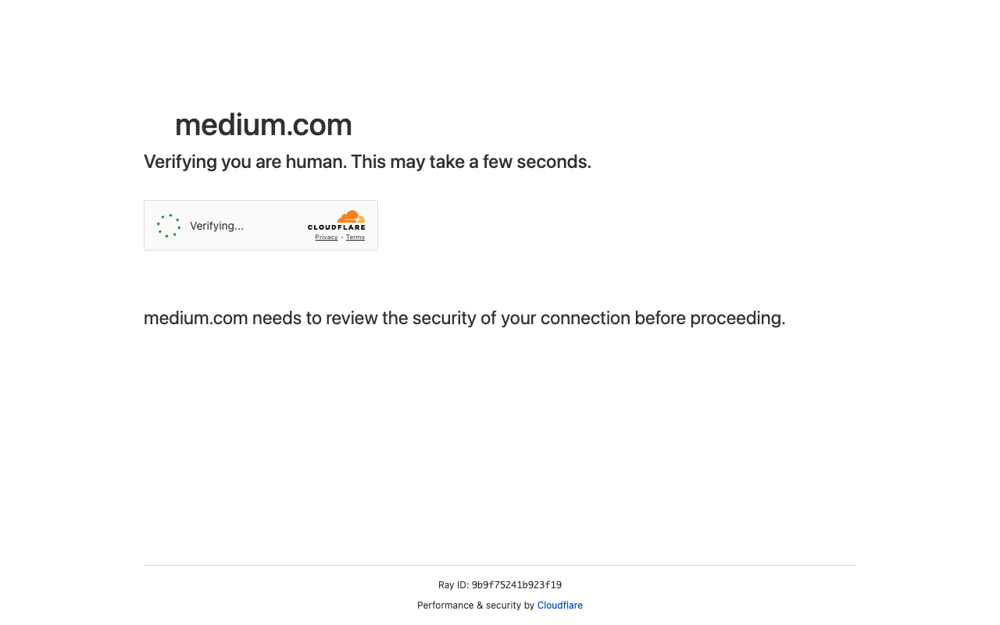
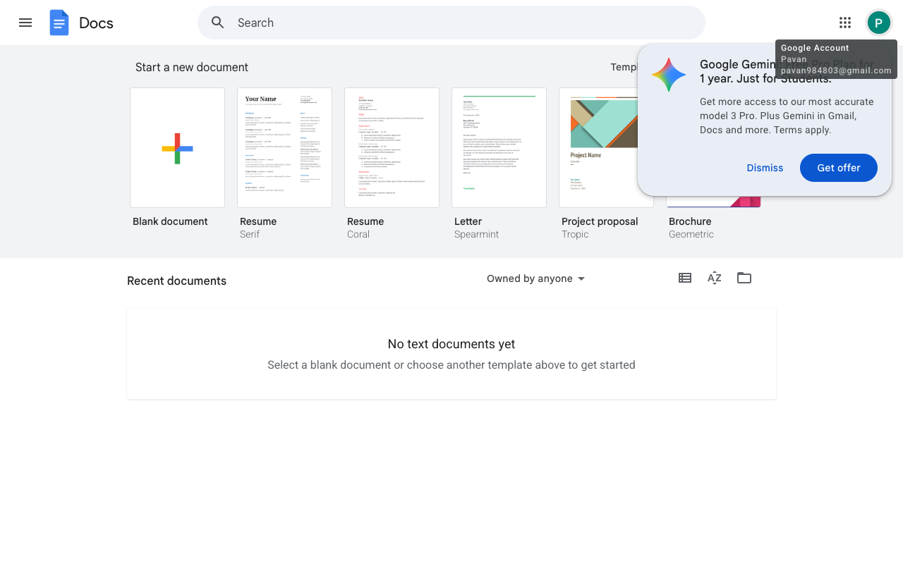

# Execution Report

**Task:** Summarize The Articles On Rag In Medium App

**Total Steps:** 2 unique screenshots (all captured images preserved in run folder)

---

## Step 1

**URL:** `https://medium.com/`

1. The screen displays a verification page from Cloudflare for medium.com. It includes a message stating, "Verifying you are human. This may take a few seconds," along with a loading icon and a note about a security review by Cloudflare.

2. The page is currently in the process of verifying the user's connection, ensuring that it is secure before granting access to medium.com.

3. Once the verification is complete, the user can expect to be redirected to the Medium.com homepage or the login page, where they can proceed to click on the 'Sign In' button and enter their credentials as part of the next steps in the automation task.

**➜ Action Taken:**  
_The user clicked on the 'Sign In' button, triggering a login modal to appear on the same page without any URL change, allowing them to input their login credentials._

---

## Step 2

**URL:** `https://medium.com/`

1. The screen shows the Google Docs interface with options to start a new document, including "Blank document" and various templates like "Resume" and "Project proposal." A notification about a Google Gemini offer is visible in the upper right corner.

2. No specific action related to entering username and password is visible. The page is idle on the Google Docs home screen, displaying options to create documents.

3. Next, the user is likely expected to interact with the document templates or acknowledge the Google Gemini offer by choosing to either "Dismiss" or "Get offer." If related to signing in, they might navigate away from this page to enter credentials.

---

