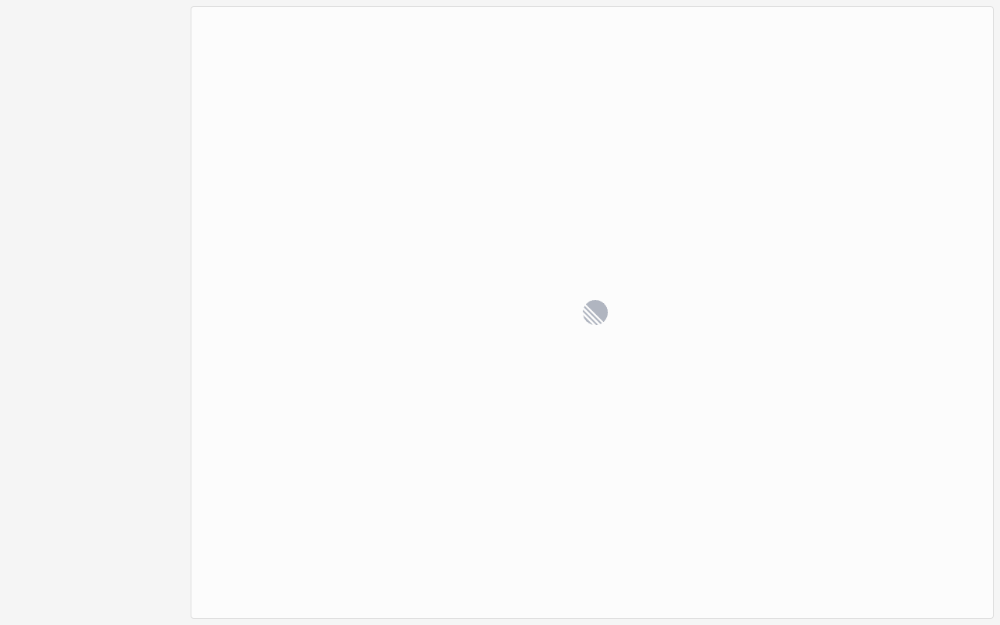

# Execution Report

**Task:** Create a project in linear with project name "My first project" & Add description as this is our first project.

**Total Steps:** 2 unique screenshots (all captured images preserved in run folder)

---

## Step 1

**URL:** `https://linear.app/auth/google/callback?state=%7B%22key%22%3A%22eROfup0wnb1gs4tA8qscS2KQeVW0JcKg%22%2C%22isMobileAppLogin%22%3Afalse%7D&code=4%2F0ATX87lOR-vdbWR04SIElgvoN7riVpSDE6aUsdUvQMIJrFSjTxcf51IN9OERTgrsfXgCx7Q&scope=email+profile+https%3A%2F%2Fwww.googleapis.com%2Fauth%2Fuserinfo.profile+https%3A%2F%2Fwww.googleapis.com%2Fauth%2Fuserinfo.email+openid&authuser=0&prompt=consent`

1. The screen shows a central loading spinner, indicating that the dashboard is currently loading. There are no other visible UI elements like buttons or text.

2. The page is in a loading state likely following a successful login attempt, as indicated by the loading spinner.

3. Once the loading completes, the user can expect the Linear dashboard to appear, displaying the main navigation and any relevant project information or tasks.

**➜ Action Taken:**  
_In this transition, the UI automation successfully completed a Google authentication callback, resulting in the user being redirected from the authorization URL to the main inbox of their Linear workspace, as indicated by the change in the URL._

---

## Step 2

**URL:** `https://linear.app/myuniqueworkspace456/inbox`

1. The screenshot displays the Linear app interface with a sidebar on the left showing navigation options such as "Inbox," "My issues," "Projects," and "Views." Currently, the "Inbox" is selected, and the main content area shows a message saying "No notifications."

2. No action appears to have been taken yet, as the current page is the "Inbox," displaying an empty state with no notifications.

3. Next, you should click on the "Projects" option in the sidebar to navigate to the projects page, as described in the step instructions. This action will redirect the main content area to display the projects view.

---

