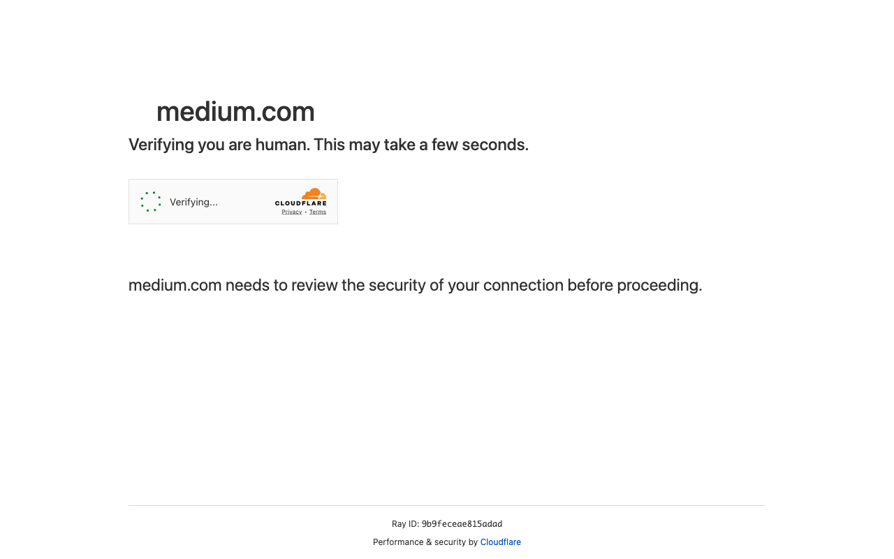

# Execution Report

**Task:** Summarize The Articles On Rag In Medium App

**Total Steps:** 1 unique screenshots (all captured images preserved in run folder)

---

## Step 1

**URL:** `https://medium.com/`

1. The screen displays a message indicating that "medium.com" is verifying the user's identity to ensure they are human. The verification process is facilitated by Cloudflare, as indicated by the branding and the progress circle next to "Verifying...".

2. The page is currently in a verification state, where Cloudflare is checking the connection's security before allowing access to Medium's homepage.

3. Once the verification is complete and the connection is deemed secure, the user should be redirected to the Medium homepage. The process is expected to take a few seconds.

---

