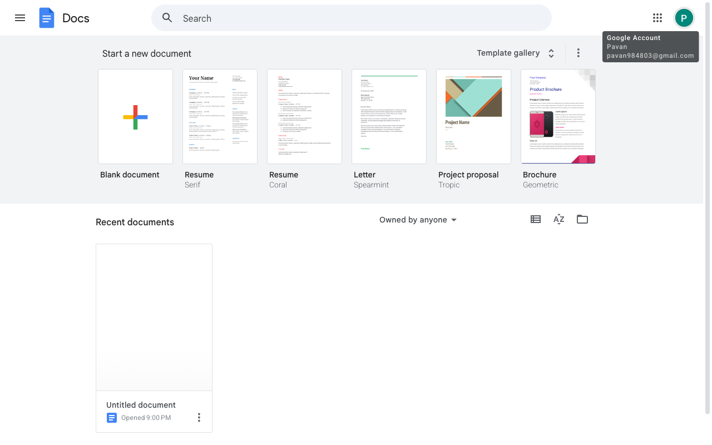

# Execution Report

**Task:** Create a Google doc with name RAG. Inside the document add the details about the RAG in detail.

**Total Steps:** 1 unique screenshots (all captured images preserved in run folder)

---

## Step 1

**URL:** `https://docs.google.com/document/u/0/`

1. The screenshot displays the Google Docs homepage, showcasing a "Start a new document" section with templates such as "Blank document," "Resume," and "Project proposal." The "Recent documents" section includes an "Untitled document" labeled as opened at 9:00 PM.

2. The page is currently in a state of idle with no action taken, as suggested by "N/A on 'N/A'" in the action description. The user's Google Account information is visible in the top right corner.

3. The next step likely involves creating a new document by selecting one of the available templates. This will transition the user to the document editor interface for further actions.

---

