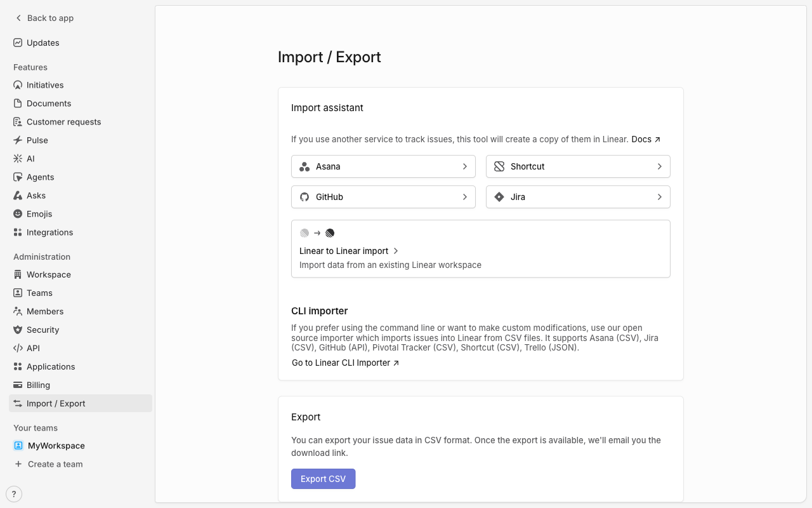

# Execution Report

**Task:** Create a project in linear with project name "My first project" & Add description as this is our first project.

**Total Steps:** 1 unique screenshots (all captured images preserved in run folder)

---

## Step 1

**URL:** `https://linear.app/myuniqueworkspace456/settings/import-export`

1. The screen displays the "Import / Export" section of a workspace dashboard, featuring options for importing data from services like Asana, GitHub, Shortcut, and Jira. An “Export CSV” button is also visible for exporting issue data.

2. The page is in a state ready for user interaction, with no action yet taken. The options to import from various services or export current data are available but inactive.

3. Next, the user can choose to import data by selecting one of the listed services or export existing data by clicking the "Export CSV" button, which will prepare the data for download.

---

