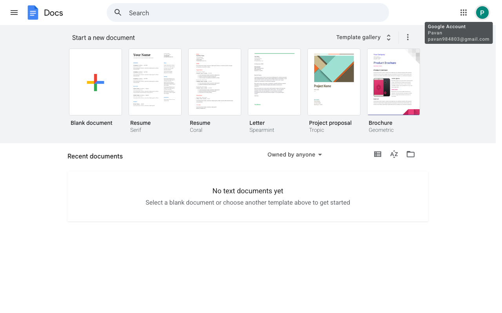

# Execution Report

**Task:** Create a Google doc with name RAG. Inside the document add the details about the RAG in detail.

**Total Steps:** 1 unique screenshots (all captured images preserved in run folder)

---

## Step 1

**URL:** `https://docs.google.com/document/u/0/`

1. The screen shows the Google Docs homepage with options to start a new document. Visible templates include "Blank document," "Resume," "Letter," "Project proposal," and "Brochure." There's also a section titled "Recent documents," which is currently empty.

2. No action has been taken yet, as indicated by the "N/A" status. The page is waiting for the user to select a document template to proceed.

3. Once the user clicks on the "Blank document" template, a new document will open, allowing the user to start creating content.

---

