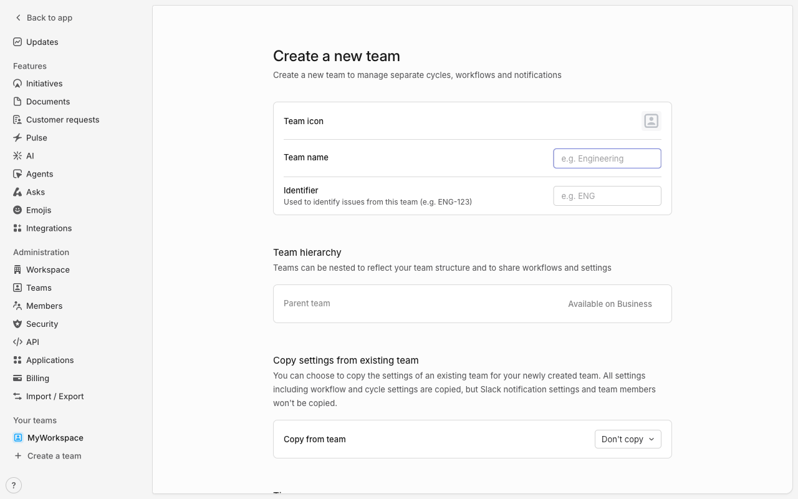

# Execution Report

**Task:** Create a project in linear with project name "My first project" & Add description as this is our first project.

**Total Steps:** 3 unique screenshots (all captured images preserved in run folder)

---

## Step 1

**URL:** `https://linear.app/myuniqueworkspace456/settings/import-export`

1. The screen displays the "Import / Export" settings page within Linear. The page features options to import issues from various services like Asana, GitHub, Shortcut, and Jira, as well as a section for exporting data in CSV format.

2. No specific action has been taken according to the context provided. The page is ready for the user to select an import source or choose to export data.

3. Next, users can either initiate an import process by selecting one of the services listed or click the "Export CSV" button to export issue data. Upon exporting, a download link will be emailed once the data is ready.

**➜ Action Taken:**  
_Between Step 1 and Step 2, the user navigated away from the "Import & Export" settings page, likely by selecting a team-related option, as indicated by the URL change to a team-focused section, displaying the active team under "MYW."_

---

## Step 2

**URL:** `https://linear.app/myuniqueworkspace456/team/MYW/active`

1. The screen displays the "Create a new team" page with fields for entering a team icon, team name, and identifier. There are options for setting team hierarchy and copying settings from an existing team. The sidebar contains options like Updates, Initiatives, and Teams.

2. The action taken indicates the user is backtracking. Currently, the interface is set up for creating a team, not a project, suggesting the user is in the wrong section for their intended task.

3. Next, the user needs to navigate back to the sidebar to find and select "Create new project" to align with their original goal of project creation. Look for relevant navigation options within the sidebar that pertain to project management.

**➜ Action Taken:**  
_The automation executed a 'back' action to navigate from the 'Create a new team' page while still within the same URL, indicating a return to a previous navigation state where the user aims to find the correct option for creating a project. No visible URL change occurred, suggesting the backtracking was likely within the app's side navigation or breadcrumb trail._

---

## Step 3

**URL:** `https://linear.app/myuniqueworkspace456/team/MYW/active`

1. The screen displays the Linear app interface, showing a list of tasks under the "Active" tab with a filter option. The tasks listed include "Get familiar with Linear," "Set up your teams," "Connect your tools," and "Import your data," each associated with an identifier like MYW-1.

2. No specific action has been taken as indicated by "N/A on 'N/A.'" The page is in a viewing state, showing a to-do list with none of the tasks checked off.

3. Next, the user may mark tasks as completed or access details of specific tasks by clicking on them. The user might also apply filters or navigate to different sections using the side panel.

---

