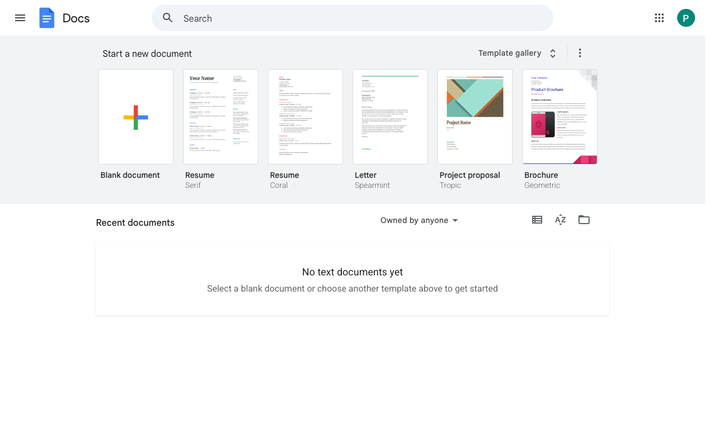

# Execution Report

**Task:** Create a Google doc with name RAG. Inside the document add the details about the RAG in detail.

**Total Steps:** 2 unique screenshots (all captured images preserved in run folder)

---

## Step 1

**URL:** `https://docs.google.com/document/u/0/`

1. The screen displays the main Google Docs interface with the option to start a new document using a template such as "Blank document" or pre-designed options like "Resume" and "Project proposal." At the bottom of the interface, there's a message stating "No text documents yet."

2. No specific action was taken, as the state implies initial access to the Google Docs dashboard where no documents are available or opened yet.

3. Next, the user can click on a template thumbnail to begin creating a new document. If authentication was required and successfully completed, they have full access to create or manage documents using available options.

**➜ Action Taken:**  
_Between these steps, an attempt to access Google Docs triggered an authentication requirement. Consequently, a redirect occurred, leading the user away from the Google Docs page to a blank or transitional URL, indicating a likely interruption or an issue in the authentication process._

---

## Step 2

**URL:** `about:blank`

1. The screen is entirely blank with no visible UI elements, text, or forms, indicating it is displaying a page with the URL `about:blank`.

2. The page is in a state where no interactions can be made, prompting a backtrack to a previous page in search of actionable elements or navigation.

3. The next expected action will be to navigate back to the prior page to find accessible interface elements or options to continue the task.

---

