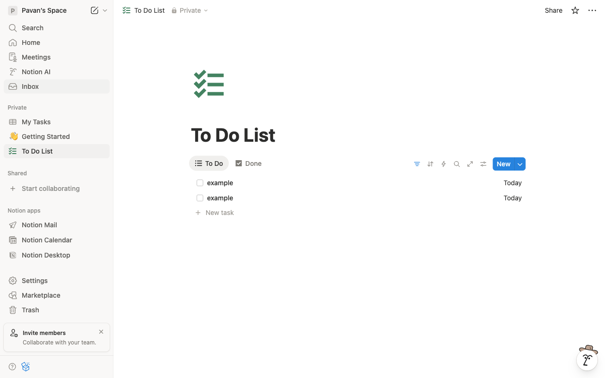
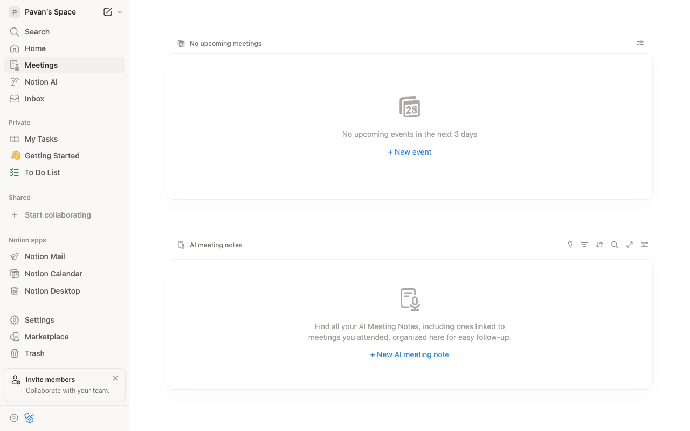
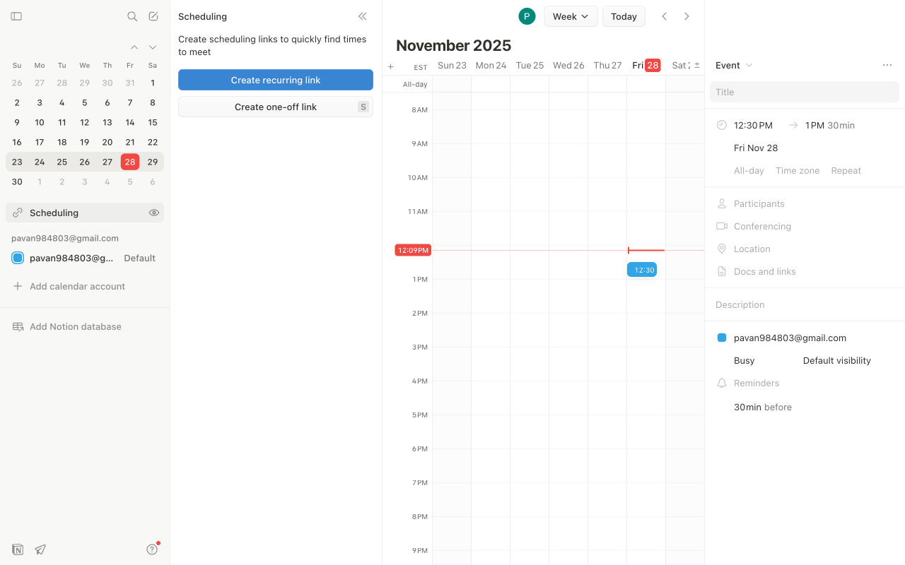

# Execution Report

**Task:** How do I create meetings in notion?

**Total Steps:** 3 unique screenshots (all captured images preserved in run folder)

---

## Step 1

**URL:** `https://www.notion.so/To-Do-List-2b656531571380858ca1fe9af87fc64a`

1. The screen displays a Notion page titled "To Do List," showing a checklist with two items labeled "example," a button for adding a new task, and filter/sort options at the top. The sidebar contains navigation options like "Home," "Meetings," and "To Do List."

2. The current state is a successfully loaded "To Do List" page with no specific action taken, as this step involves capturing the current view after login.

3. Next, the user may proceed to interact with the tasks, either by adding new items, marking tasks as done, or using the available filters and sort options to organize the list.

**➜ Action Taken:**  
_The automation navigated the user from a "To-Do List" page to a "Meet" page within Notion, resulting in a URL change from "https://www.notion.so/To-Do-List-2b656531571380858ca1fe9af87fc64a" to "https://www.notion.so/meet," indicating a transition to a new section or workspace dedicated to meetings._

---

## Step 2

**URL:** `https://www.notion.so/meet`

1. The screen displays the "Meetings" section of a Notion workspace, showing two primary areas: "No upcoming meetings" with an option to add a new event, and "AI meeting notes" with an option to add a new AI meeting note. The sidebar contains navigation links and options for other sections such as "Home," "My Tasks," and "Notion Calendar."

2. The page is currently in a state where there are no scheduled meetings or notes available, as indicated by the empty messages and the absence of event listings.

3. Next, the user might click on the "+ New event" or "+ New AI meeting note" links to begin adding meetings or notes to the database, which will likely populate this section with information.

**➜ Action Taken:**  
_Between Step 2 and Step 3, an action was performed within the same page of the Notion workspace, resulting in no change in the URL. This action likely altered the visible content or layout on the Notion page, updating the view or data without redirecting away from the current workspace interface._

---

## Step 3

**URL:** `https://www.notion.so/meet`

1. The screenshot shows a calendar interface with a week view in November 2025. A sidebar on the left displays a calendar and scheduling options, while the center shows a timeline of events. On the right, an event detail pane is visible with fields for Title, Date, Time, and options for Participants, Conferencing, Location, and more.

2. The action taken involves clicking on the "Title" field, indicating the user is in the process of entering or planning a new meeting. The event details pane reflects this state with fields available for customization.

3. Next, the user is expected to enter specific details into the provided fields such as Title, Date, Time, and Description of the meeting. This will set up the meeting with the necessary information displayed in the calendar interface.

---

