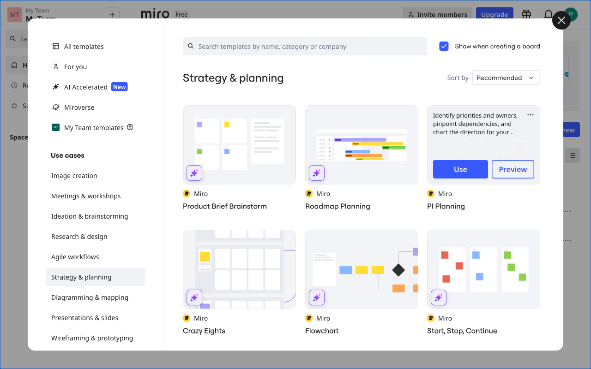
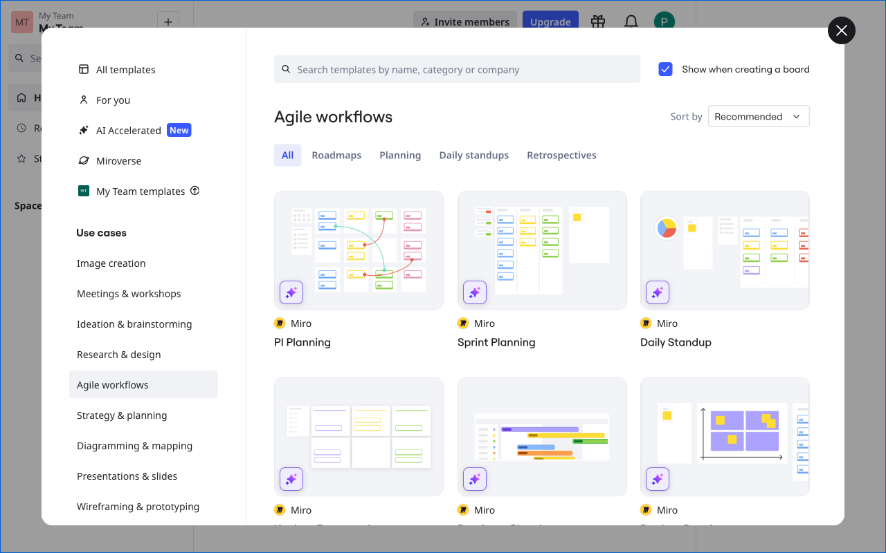

# Execution Report

**Task:** How do I create agile workflows in miro?

**Total Steps:** 3 unique screenshots (all captured images preserved in run folder)

---

## Step 1

**URL:** `https://miro.com/app/dashboard/`

1. The screen shows the Miro dashboard, specifically the "Strategy & planning" section with several templates available, such as "Product Brief Brainstorm" and "Roadmap Planning." A sidebar displays various categories like "All templates" and "Use cases."

2. The page is in a browsing state, showcasing templates for selection. No specific action has been taken as buttons like "Use" and "Preview" are visible but not activated.

3. Next, a user might select a template to use or preview by clicking the corresponding buttons, which will guide them to a more detailed setup or editing page for that template.

**➜ Action Taken:**  
_The UI automation triggered an in-app update, refreshing the dashboard content without changing the URL, resulting in updated dashboard information or interface components._

---

## Step 2

**URL:** `https://miro.com/app/dashboard/`

1. The screen displays a selection of Agile workflow templates in Miro, with options like "PI Planning" and "Sprint Planning" visible. The interface includes a sidebar with categories such as "All templates" and "Agile workflows," and a main area showing template thumbnails.

2. The state of the page indicates that the "Sprint Planning" template has been selected for further action. This is part of the process of confirming and creating a board with the chosen Agile Workflow template.

3. Next, selecting the "Sprint Planning" template will likely lead to the creation of a new board based on this template, allowing for further customization and setup of the sprint planning process within Miro.

**➜ Action Taken:**  
_Upon clicking 'Sprint Planning,' the interface transitioned to a new board page, confirming the selection and application of the Agile Workflow template, as indicated by the updated URL._

---

## Step 3

**URL:** `https://miro.com/app/board/uXjVJjODrm4=/`

1. The screen displays a Miro board titled "PI Planning" with several objects selected, indicated by the bounding box around them. There is a sidebar on the right titled "Agile Coaching" which offers options such as "Analyze engagement patterns" and "Create Kanban setup."

2. The page is in a state where 45 objects are selected on the Miro board, as noted below the board in the popup. No specific action has been taken yet as the action is labeled as "N/A on N/A."

3. Next, the user might choose one of the Agile Coaching options such as designing a Kanban setup or analyzing engagement patterns. This could involve interacting with the selected objects on the board to implement agile techniques.

---

