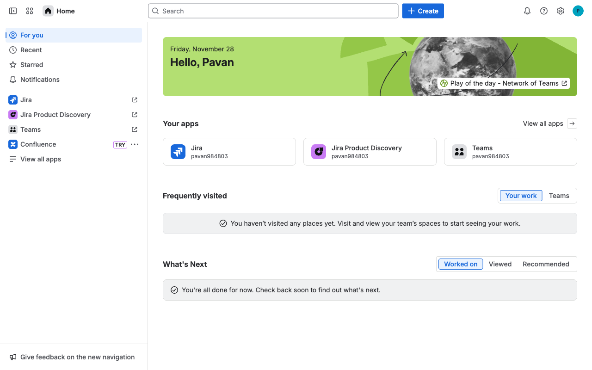

# Execution Report

**Task:** How do I create a roadmap in jira?

**Total Steps:** 4 unique screenshots (all captured images preserved in run folder)

---

## Step 1

**URL:** `https://home.atlassian.com/o/8c4b6fb0-968f-43da-9d92-a246986f7481/?utm_source=identity&cloudId=41d9039f-2f3e-4e98-8813-591c3ff1c028`

1. The screen shows the Atlassian home page with a sidebar on the left listing apps like Jira, Jira Product Discovery, Teams, and Confluence, along with a section titled "For you" that includes options like Recent, Starred, and Notifications. The main panel displays a welcome message, a "Your apps" section, and areas for "Frequently visited" locations and "What's Next."

2. The page appears to be in a static state, waiting for user interaction. No specific action is highlighted or in progress.

3. The next step would likely involve the user taking an action, such as selecting one of the apps from the sidebar or main panel to navigate to its specific dashboard or section.

**➜ Action Taken:**  
_Between Step 1 and Step 2, an interaction occurred that did not alter the URL, suggesting a client-side change such as form submission, UI update, or element state change. The exact action is not identified, but it resulted in an update visible to the user without navigating away from the current page._

---

## Step 2

**URL:** `https://home.atlassian.com/o/8c4b6fb0-968f-43da-9d92-a246986f7481/?utm_source=identity&cloudId=41d9039f-2f3e-4e98-8813-591c3ff1c028`

1. The screen displays the "Spaces" section of a Jira interface, showing a search bar with filters for "Jira - software spaces" and "Jira - business spaces." There's a message indicating no spaces were found matching the search criteria.

2. The "More spaces" option was clicked, likely leading to a search within broader or additional spaces given the context.

3. Next, the user may adjust the search filters or parameters to locate existing spaces, or they might click "Create space" to begin creating a new space.

**➜ Action Taken:**  
_Upon clicking 'More spaces', a dropdown menu expanded, revealing additional options within the same page context. This allowed the 'Create Roadmap' button to become visible and accessible for interaction._

---

## Step 3

**URL:** `https://home.atlassian.com/o/8c4b6fb0-968f-43da-9d92-a246986f7481/?utm_source=identity&cloudId=41d9039f-2f3e-4e98-8813-591c3ff1c028`

1. The screen displays the "Space templates" section with categories listed on the left. The "Made for you" section is highlighted, showing three templates: "Product roadmap," "IT service management," and "Top-level planning," each with visual previews and labels indicating availability or recommendation status.

2. The action taken is a click on the "Product roadmap" card, which is marked as recommended.

3. Next, selecting the "Product roadmap" template will likely lead to a detailed page where the user can configure, edit, or save their newly created roadmap using this template.

**➜ Action Taken:**  
_After clicking on the 'Product roadmap', there is no change in the URL, indicating the action triggers the display of options or settings related to the roadmap on the same page, allowing the user to proceed with saving the newly created roadmap without navigating away._

---

## Step 4

**URL:** `https://home.atlassian.com/o/8c4b6fb0-968f-43da-9d92-a246986f7481/?utm_source=identity&cloudId=41d9039f-2f3e-4e98-8813-591c3ff1c028`

1. The screen displays a "Product roadmap" template within the "Space templates" section. It includes a description of the template's benefits, such as sharing roadmaps and engaging teams, alongside illustrations and a "Use template" button.

2. No specific action has been taken yet; the page is in a state where the user is reviewing the template details and considering its use.

3. The next expected step is for the user to click the "Use template" button to begin creating a roadmap using this template.

---

