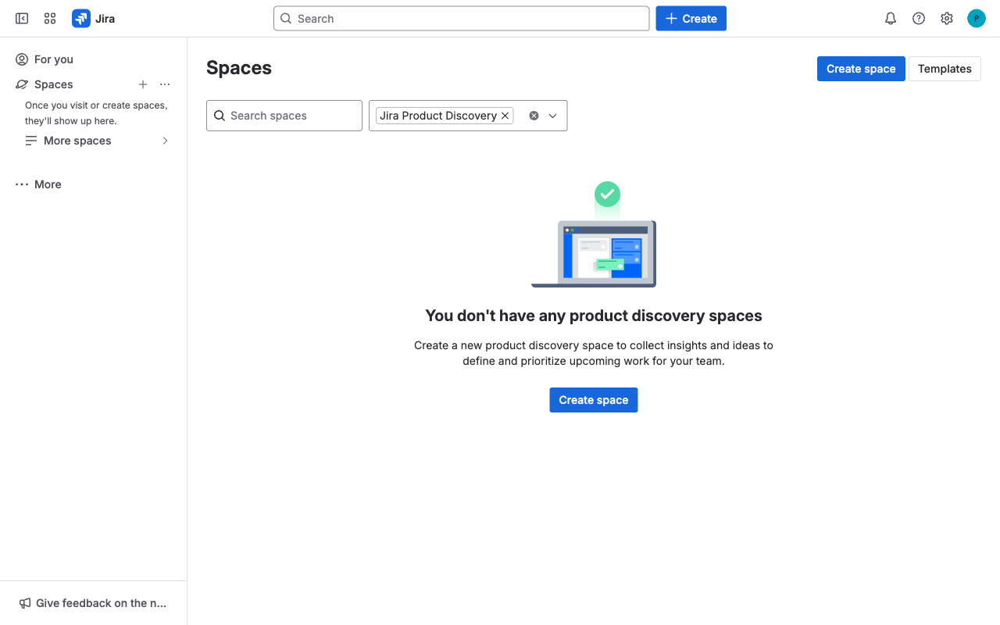
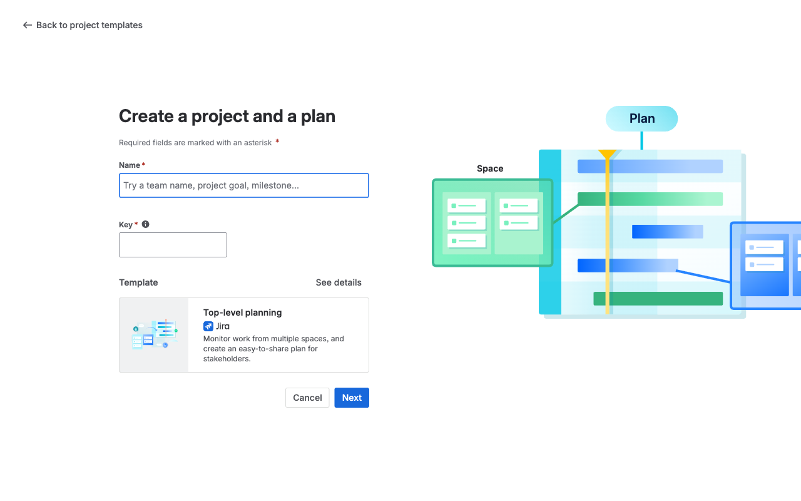

# Execution Report

**Task:** How do I create plan in jira?

**Total Steps:** 3 unique screenshots (all captured images preserved in run folder)

---

## Step 1

**URL:** `https://home.atlassian.com/o/8c4b6fb0-968f-43da-9d92-a246986f7481/?utm_source=identity&cloudId=41d9039f-2f3e-4e98-8813-591c3ff1c028`

1. The screenshot shows the dashboard page of an Atlassian account. Visible elements include navigation links on the left for "For you," "Jira," "Teams," and others, a greeting section with "Hello, Pavan," and a list of apps such as Jira and Jira Product Discovery.

2. The page is in the initial state after logging in, displaying a personalized dashboard. No specific action was taken as indicated by "N/A on N/A."

3. Next, the user might start using one of the listed apps or explore other navigation options. They may also provide feedback using the button at the bottom left of the screen.

**➜ Action Taken:**  
_Between Step 1 and Step 2, a non-visible interaction occurred without changing the URL, likely involving an internal process or a background task that maintained the current page state. The user interface remained static, indicating no apparent visual change for the user._

---

## Step 2

**URL:** `https://home.atlassian.com/o/8c4b6fb0-968f-43da-9d92-a246986f7481/?utm_source=identity&cloudId=41d9039f-2f3e-4e98-8813-591c3ff1c028`

1. The screen shows a Jira "Spaces" page, indicating no existing product discovery spaces with a prompt to create one. The interface includes a search bar, filter dropdown, and a prominent "Create space" button both on the main area and the top right corner.

2. The action taken involves clicking the "Create space" button, which is highlighted in blue, indicating initiation of the process to create a new space.

3. After clicking "Create space," the user can expect to be directed to a form or setup wizard to configure details and settings for the new product discovery space.

**➜ Action Taken:**  
_After clicking 'Create space,' a new interface or form likely appeared within the same page, allowing the user to input details for the new plan, while the URL remained unchanged._

---

## Step 3

**URL:** `https://home.atlassian.com/o/8c4b6fb0-968f-43da-9d92-a246986f7481/?utm_source=identity&cloudId=41d9039f-2f3e-4e98-8813-591c3ff1c028`

1. The screen shows a form titled "Create a project and a plan," requiring a "Name" and "Key" for the project, both marked with asterisks to indicate they are mandatory fields. Below these fields, a template titled "Top-level planning" is selected, with a brief description alongside it, and "Cancel" and "Next" buttons at the bottom.

2. The current state of the page is setup for creating a new project using the selected template, with no specific action taken yet as indicated by the fields being blank.

3. Next, the user is expected to fill in the "Name" and "Key" fields, then click "Next" to proceed with creating the project plan using the top-level planning template.

---

